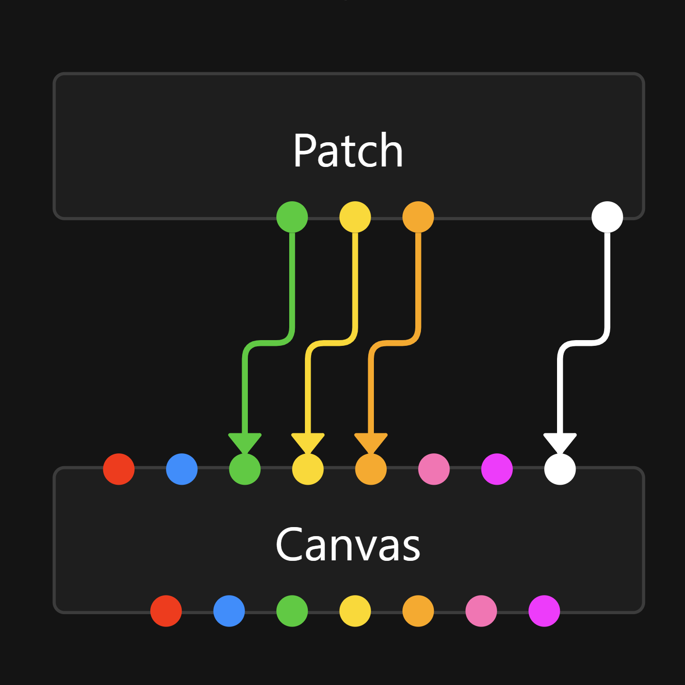

#   PatchCanvas



A tool for documenting patches between professional hardware and software components

Check it out, it's live here: [theonlytechnohead.github.io/patchcanvas](https://theonlytechnohead.github.io/patchcanvas/)

## Developer overview

PatchCanvas is this project, and it uses:
- [Node.js](https://nodejs.org) as the development JavaScript runtime environment
- [Vite](https://vitejs.dev/) as the project management and build system
- [Yarn](https://yarnpkg.com/) as the package (and some project) management system
- [Svelte](https://svelte.dev/) as the component-based compositional compiled UI framework
- [xyflow](https://www.xyflow.com/) as the node-based UI library for Svelte
- [GitHub Pages](https://pages.github.com/) for hosting the compiled application
- [gh-pages](https://github.com/tschaub/gh-pages) as a Node.js utility for publishing to GitHub Pages

### How to contribute

#### Clone the repository
```sh
git clone https://github.com/theonlytechnohead/patchcanvas.git
```
This downloads all the code and assets to your device

#### Install dependencies
```sh
yarn
```
This fetches and sets up all the required libraries and dependencies for running the project

#### Run the dev environment
```sh
yarn dev
```
This will start up a web server that you can connect to at [https://localhost:5173](https://localhost:5173) and supports hot-reload of your changes (on supported configurations)

#### (Optionally) Compile the app for testing
```sh
yarn build
```
This will compile all the Svelte code into native JavaScript and TypeScript and CSS and HTML and bundle it all together into one or two files

#### When I accept your [pull request](https://docs.github.com/en/pull-requests/collaborating-with-pull-requests/proposing-changes-to-your-work-with-pull-requests/about-pull-requests), I will publish the app
```sh
yarn deploy
```
You'll probably never be able to run this command, as you don't have permission to push directly to this repository
